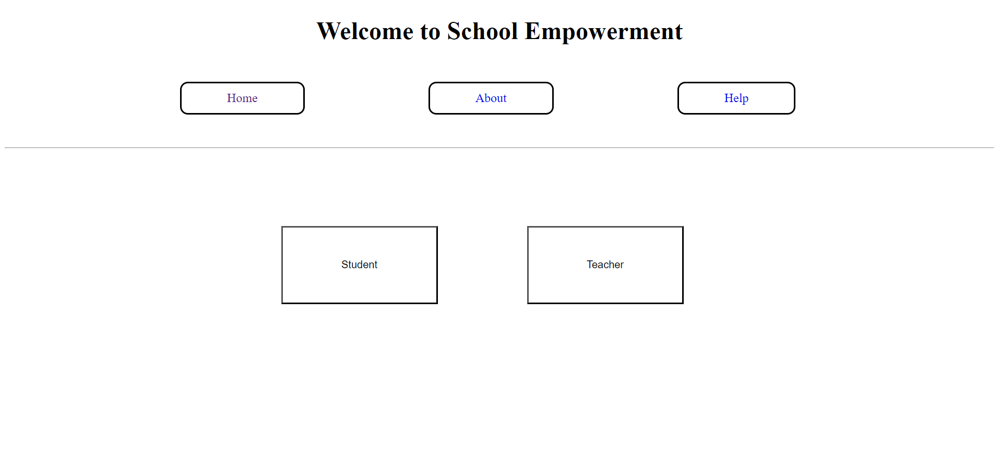
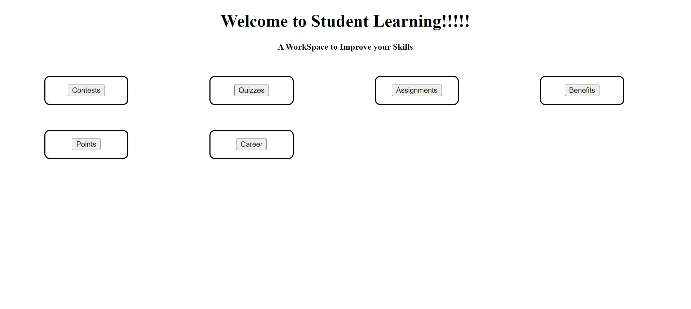
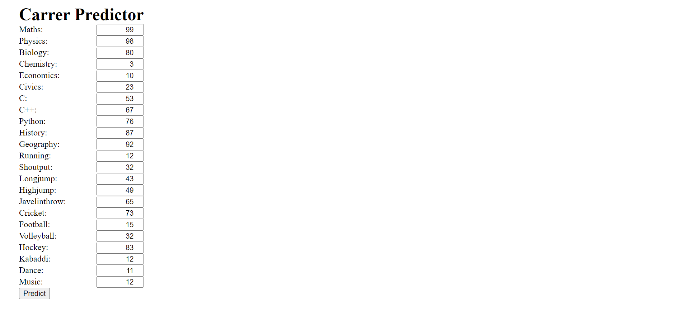
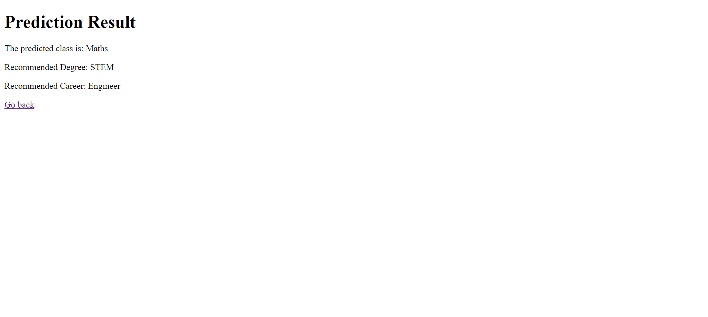

# Career Management for Students 🌟


Welcome to the **Career Management for Students** project! 🎓 This web-based application helps manage student assignments, rewards them with points, and predicts the best career paths based on their performance. 🚀

## 📑 Table of Contents

- [Features](#features)
- [Technologies Used](#technologies-used)
- [Screenshots](#screenshots)
- [Getting Started](#getting-started)
  - [Prerequisites](#prerequisites)
  - [Installation](#installation)
  - [Running the Application](#running-the-application)
- [Usage](#usage)
  - [Student Registration and Login](#student-registration-and-login)
  - [Teacher Login](#teacher-login)
  - [Assignments and Points](#assignments-and-points)
  - [Career Prediction](#career-prediction)
  - [Career Recommendations](#career-recommendations)

## 🚀 Features

- **User Authentication** 🔐: Separate login pages for students and teachers.
- **Assignment Management** 📝: Students can view and submit assignments.
- **Point System** 💯: Points awarded for completed assignments, redeemable for benefits.
- **Career Prediction** 🧠: AI model predicts the best career path for students based on their performance.

## 🛠️ Technologies Used

- **Flask**: Web framework for Python.
- **TensorFlow**: For building and loading the AI model.
- **Pandas**: For data manipulation and analysis.
- **Scikit-learn**: For preprocessing data.
- **HTML/CSS**: For front-end design.

## 📸 Screenshots

Here are some screenshots of the application:

1. **Home Page**
    

2. **Student Dashboard**
    

3. **Points Earned**
    
   
4. **Career Prediction Results**
    

   
## Getting Started 🏃‍♂️

### Prerequisites

Ensure you have the following installed:

- Python 3.8+
- Flask
- TensorFlow
- Pandas
- Scikit-learn

### Installation

1. **Clone the repository**:
    ```sh
    git clone https://github.com/sriram00001/career-management.git
    cd career-management-students
    ```

2. **Install the required packages**:
    ```sh
    pip install -r requirements.txt
    ```

3. **Place your trained model (`fil.h5`) and dataset (`nn.csv`) in the root directory of the project**.

### Running the Application

1. **Set the FLASK_APP environment variable**:
    ```sh
    export FLASK_APP=app.py
    ```

2. **Run the Flask application**:
    ```sh
    flask run
    ```

3. **Open your web browser and go to** [http://127.0.0.1:5000/](http://127.0.0.1:5000/) **to view the application**.

## Usage 🔍

### Student Registration and Login

Students can register and log in to their accounts. Once logged in, they can view available assignments, submit their work, and track their points. 📚

### Teacher Login

Teachers can log in to assign tasks to students and manage student data. 🧑‍🏫

### Assignments and Points

Students earn points by completing assignments. These points can be redeemed for various benefits listed on the platform. 🎁

### Career Prediction

Upon completion of the 10th standard, students' accumulated points and performance data are analyzed by an AI model to predict the best career path. 📈

### Career Recommendations

The AI model provides career recommendations based on the student's performance in different subjects and activities. The recommendations include suggested degrees and potential career paths. 🏆


## License 📝

This project is licensed under the MIT License - see the [LICENSE](LICENSE) file for details.


---

